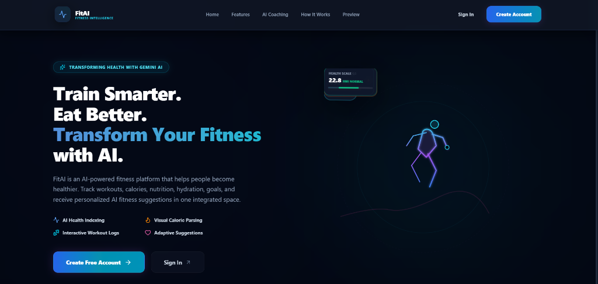
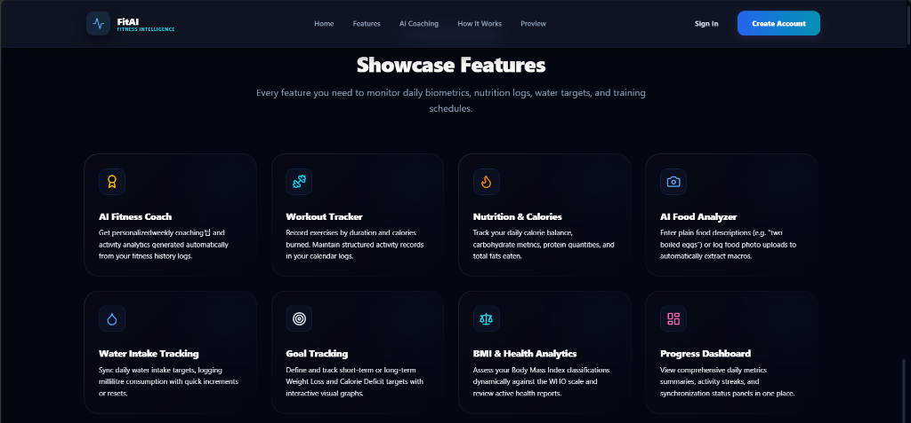
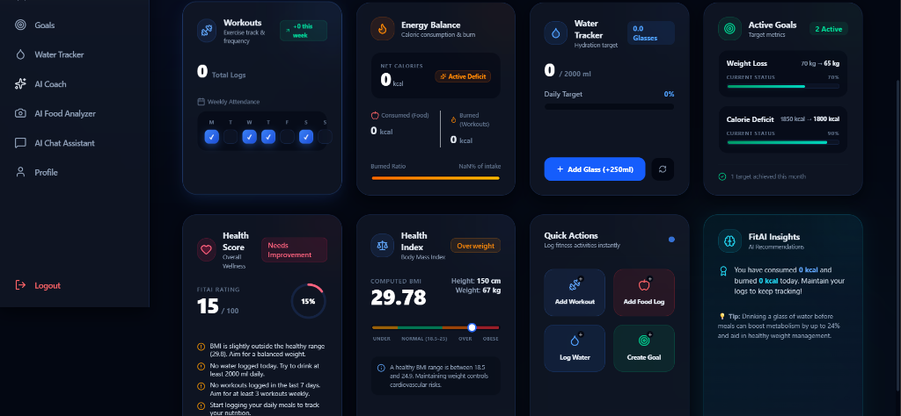

# FitAI — AI-Powered Fitness & Health Application

FitAI is a health and fitness tracking application built on the MERN (MongoDB, Express, React, Node.js) stack and integrated with the Google Gemini API. The platform provides users with toolsets to monitor biometrics, log exercises, track nutritional macros, manage hydration goals, and generate automated fitness advice based on user-submitted logs.

The user interface uses a responsive dark-themed glassmorphism layout, providing a consolidated workspace for daily progress indicators, health indices, and goal tracking.

---

## Core Features

### 🔐 Authentication
* **JWT Authorization**: JSON Web Token implementation for secure user registration, login, and protected route access.
* **Session Guards**: Automatic client-side redirect to the login page upon token expiration or unauthorized requests (HTTP 401).

### 📊 Dashboard
* **Biometric Summary**: Real-time display of user health parameters, caloric balance, hydration status, and active fitness goals.
* **AI Recommendations**: Daily suggestions based on the user's logged activities and metrics.

### 🏋️‍♂️ Workout Management
* **Activity Logging**: Log exercises by category, duration, estimated calories burned, notes, and date.
* **Weekly Attendance**: Visual attendance indicators tracking training consistency across a 7-day calendar.

### 🍎 Nutrition Tracking
* **Macronutrient Logging**: Record food items to compute daily macro intake, including protein, carbohydrates, fats, and total calories.
* **Calorie Budgeting**: Track calories consumed against daily targets based on computed biometric logs.

### 💧 Hydration Tracking
* **Daily Fluid Log**: Increment water intake records in 250ml units.
* **Hydration Progress**: Dynamic percentage indicators tracking daily fluid intake against target goals.

### 🎯 Goal Management
* **Weight & Deficit Targets**: Create weight loss, weight gain, or calorie deficit milestones with dynamic progress bars indicating completion rates.

### 🤖 Google Gemini AI Integrations
* **Fitness Coach**: Generates personalized health recommendations and custom 7-day training schedules.
* **Food Image Analyzer**: Uses vision models to analyze uploaded meal photographs to estimate nutritional content and ingredient macros.
* **Chat Assistant**: A natural language chat interface to query the assistant regarding exercise routines and nutrition.
* **Health Score**: Calculates a global wellness score out of 100 with computed strengths and areas for improvement.

---

## Project Screenshots

### 1. Landing Page Hero

*Landing page outlining the platform's core capabilities and fitness outcome goals.*

### 2. Showcase Features

*Feature showcase section describing the available workout, food, and water tracking capabilities.*

### 3. Integrated User Dashboard

*The central workspace displaying active biometrics, Health Index (BMI), EKG health rating, and active streaks.*

---

## Tech Stack

| Component | Technology | Description |
| :--- | :--- | :--- |
| **Frontend** | React 19, React Router v7 | Single-Page Application framework |
| **Styling** | Tailwind CSS | Utility-first styling for layout elements |
| **Icons** | Lucide React | Clean, scalable vector icons |
| **Backend** | Node.js, Express.js | REST API server routing and middleware |
| **Database** | MongoDB, Mongoose ODM | Document database for persistent data storage |
| **Security** | JSON Web Tokens, Bcrypt.js | Password hashing and session authorization |
| **AI Integration**| Google Gemini API | Gemini Flash (Text) and Gemini Pro Vision (Image) integrations |
| **HTTP Client** | Axios | Network integration and request interceptors |

---

## Folder Structure

```
AI-Fitness-Tracker/
├── backend/
│   ├── src/
│   │   ├── config/       # Database connection configuration (db.js)
│   │   ├── controllers/  # Route controller handlers (auth, workouts, food, goals, etc.)
│   │   ├── middleware/   # JWT verification middleware
│   │   ├── models/       # Mongoose database schemas (User, Workout, Food, Goal, Water)
│   │   ├── routes/       # Express route endpoints
│   │   └── utils/        # Token generators and helper utilities
│   ├── server.js         # Entry point for backend Express app
│   └── package.json
├── frontend/
│   ├── src/
│   │   ├── assets/       # Styles, images, and static graphics
│   │   ├── components/   # Shared layouts & dashboard widgets (BMICard, WaterCard, etc.)
│   │   ├── context/      # React global authentication context
│   │   ├── layouts/      # Dashboard and public view containers
│   │   ├── pages/        # View routes (Dashboard, Workouts, Profile, AICoach, etc.)
│   │   ├── routes/       # Protected routing wrappers (PrivateRoute, GuestRoute)
│   │   └── services/     # Axios client configuration and API methods
│   ├── index.html        # Main HTML layout template
│   └── package.json
└── screenshots/          # Repository screenshots directory
```

---

## Installation

### Prerequisites
* **Node.js** (v18.0.0 or higher)
* **MongoDB** (Local Community Server or Atlas Cluster)
* **Google Gemini API Key** (Accessible via Google AI Studio)

### 1. Install Backend Dependencies
```bash
cd backend
npm install
```

### 2. Install Frontend Dependencies
```bash
cd ../frontend
npm install
```

### 3. Build Project
```bash
npm run build
```

### 4. Run Backend
```bash
cd ../backend
npm run dev
```

### 5. Run Frontend
```bash
cd ../frontend
npm run dev
```
Access the application locally at the default Vite server address (e.g. `http://localhost:5173`).

---

## API Overview

### Authentication
* `POST /api/auth/register` - Register a new user account (collects Name, Email, Password, Height, Weight, Age, Gender)
* `POST /api/auth/login` - Authenticate credentials and return JWT token
* `GET /api/auth/profile` - Get current user profile details
* `PUT /api/auth/profile` - Update user metrics and parameters

### Workouts
* `GET /api/workouts` - Retrieve exercise history logs sorted by date descending
* `POST /api/workouts` - Log a new workout (Type, Duration, Calories, Notes, Date)
* `DELETE /api/workouts/:id` - Delete an exercise log by ID

### Nutrition (Food)
* `GET /api/foods` - Retrieve calorie and meal entries
* `POST /api/foods` - Log food intake (Name, Calories, Protein, Carbs, Fats, Meal Type, Date)
* `DELETE /api/foods/:id` - Delete a logged food entry

### Goals
* `GET /api/goals` - Fetch weight and calorie deficit targets
* `POST /api/goals` - Create a new goal milestone
* `PUT /api/goals/:id` - Update goal progress metrics or completion status
* `DELETE /api/goals/:id` - Remove goal

### Water
* `GET /api/water` - Fetch today's hydration history logs
* `GET /api/water/stats` - Fetch total daily fluid intake and goal progress
* `POST /api/water` - Increment water intake (logs a standard 250ml glass)
* `DELETE /api/water/:id` - Delete a water log entry

### AI Services
* `GET /api/ai/recommendations` - Get computed recommendations based on user history
* `GET /api/ai/workout-plan` - Retrieve custom 7-day exercise schedule
* `GET /api/ai/health-score` - Retrieve overall computed health rating
* `POST /api/ai/chat` - Chat with natural language AI Coach assistant
* `POST /api/ai/analyze-food-image` - Upload and analyze food pictures via Gemini Vision

---

## Deployment

### Backend
Can be deployed to hosting platforms like **Render**, **Railway**, or **Heroku**:
1. Connect your repository to the hosting platform.
2. Configure the build commands (`npm install`) and start command (`node server.js` or `npm start`).
3. Set the required configuration variables in the platform's settings dashboard.

### Frontend
Can be deployed to static hosting platforms like **Vercel** or **Netlify**:
1. Connect your frontend project root directory.
2. Set the build command to `npm run build` and publish directory to `dist`.
3. Configure the backend API origin URL in the build settings environment variables.

---

## Future Improvements
* **Wearable Device Integration**: Sync with smart device APIs (e.g. Apple HealthKit or Google Fit API) to import workouts and steps automatically.
* **Social Milestones**: Share achievements and goal progress with friends.
* **Offline Caching**: Integrate Service Workers/IndexedDB for offline capabilities.

---

## License

This project is licensed under the MIT License - see the [LICENSE](LICENSE) file for details.
